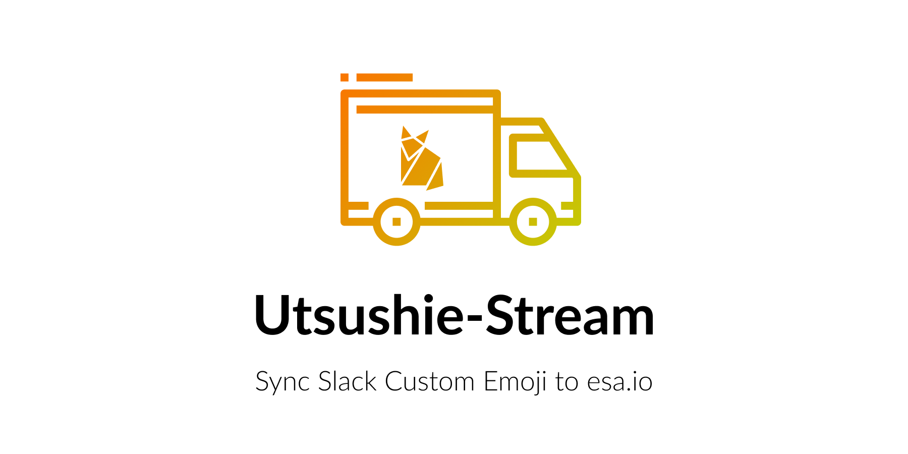

Utsushie-Stream はSlackの [emoji_changed event](https://api.slack.com/events/emoji_changed) に反応して、Slackに登録されたEmojiをesaにコピーするツールです。

Utsushie-Stream is a tool that hooks [emoji_changed event](https://api.slack.com/events/emoji_changed) and syncs Slack Custom Emoji to esa.

## Usage
[こちら](usage.md)を参照してください。

## LICENSE
[MIT](LICENSE)

## Note
Icon made by Freepik from [www.flaticon.com](https://www.flaticon.com)
