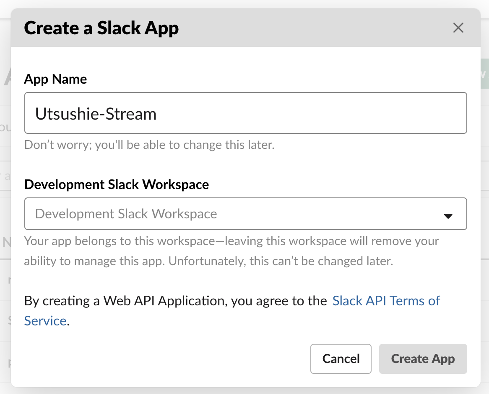
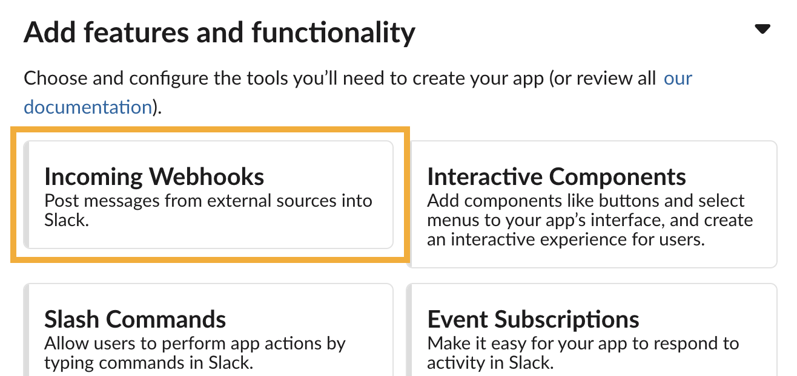
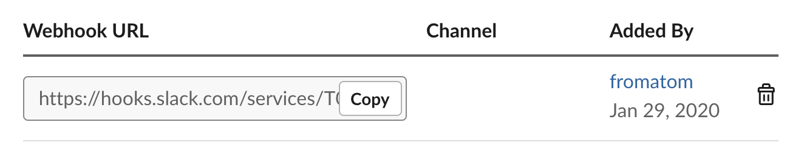
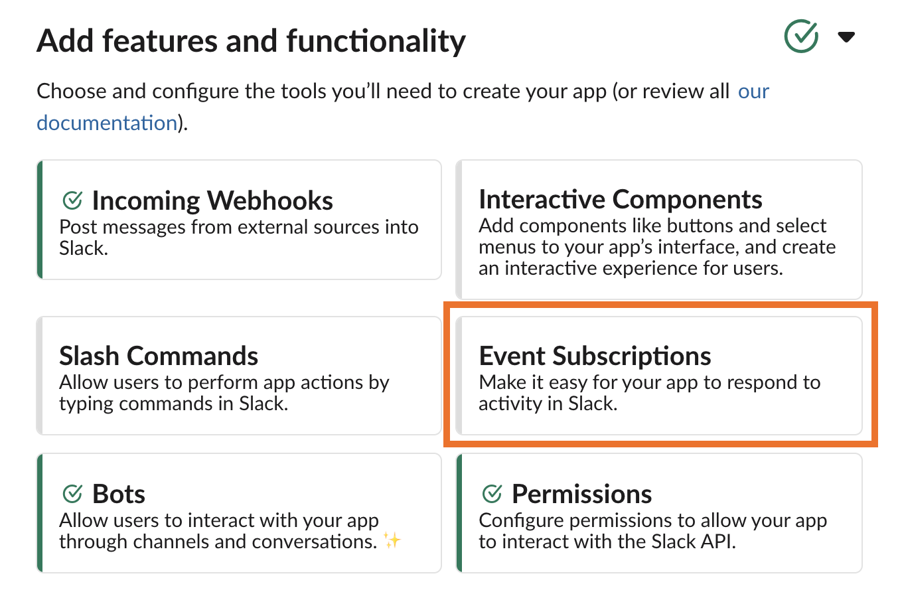
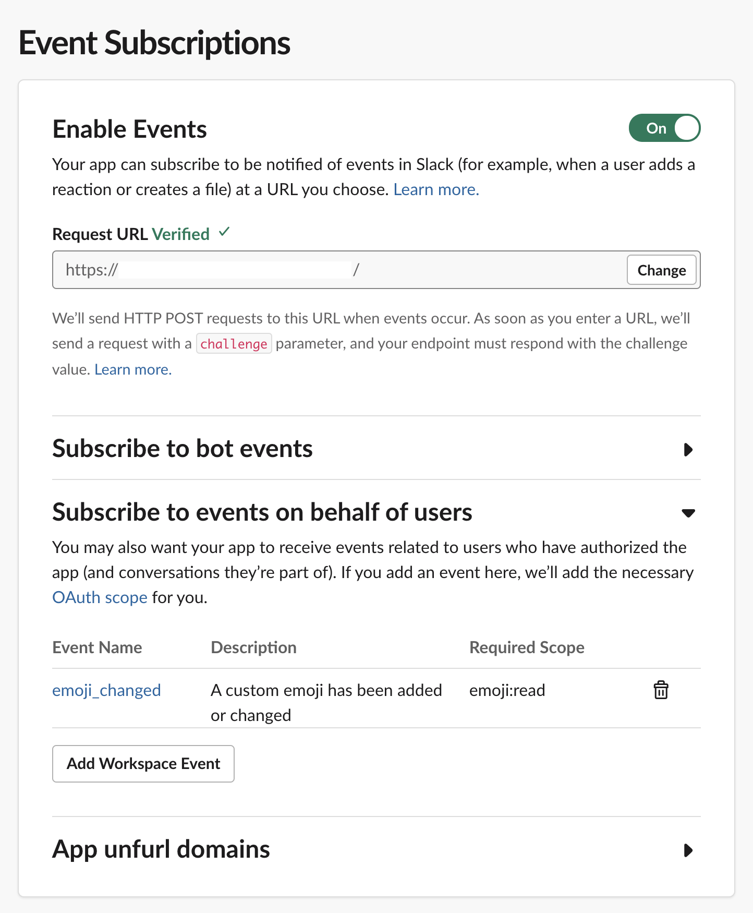
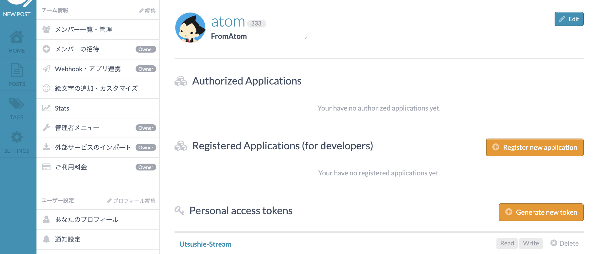

# How to use
## 1. [https://api.slack.com/apps](https://api.slack.com/apps) に行き "Create New App" ボタンをクリックする

## 2. アプリ名とWorkspaceを入力して "Create App" をクリック

## 3. "Basic Information" から "Incomming Webhooks" をクリック

## 4. Webhook URLを生成してコピーしておく

## 5. "Basic Information" から "Event Subscriptions" をクリック

## 6. 各種設定をする

- デプロイしたUtsushie-StreamのURLを入力してVerifyされるか確認する
- "Add Workspace Event" ボタンから `emoji_changed`  eventを追加

## 7. https://YOUR_TEAM.esa.io/user/applications に行きPersonal Access Tokenを取得する

Read/Write権限が必要なので注意

## 8. Utsushie-Streamの環境変数を設定する
これまでの作業で下記が揃っているはずなので設定する

- ESA_ACCESS_TOKEN
  - 7．の作業で取得したもの
- ESA_TEAM_NAME
  - https://TEAM_NAME.esa.io/
- SLACK_WEBHOOK_URL
  - 4．の作業で取得したもの
